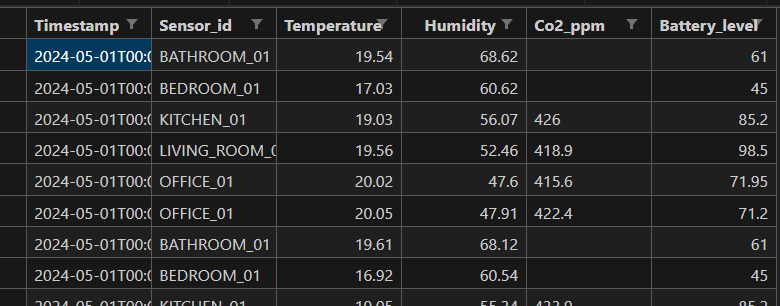
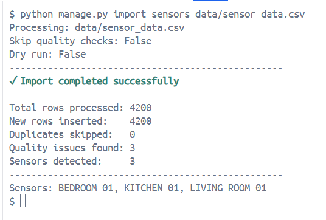
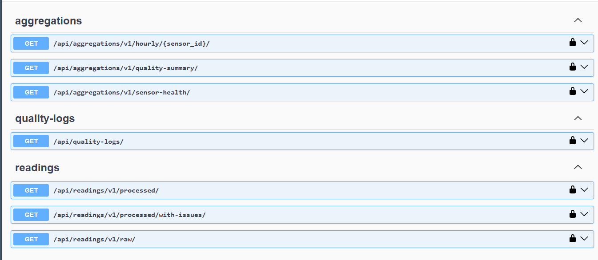

# Sensor Data Processing API

## Overview

This project implements a backend service for ingesting, processing, and serving sensor data. It handles the full lifecycle from raw CSV import to structured API queries. The system is designed for reliability, data integrity, and ease of deployment.

## Approach and Architecture

The solution prioritizes pragmatism and data correctness over unnecessary complexity.

### What I Do

1.  **Ingest:** Accept raw sensor data via CSV.
2.  **Validate:** Detect and handle bad data during processing.
3.  **Store:** Persist clean data in a relational database.
4.  **Serve:** Expose processed data through a REST API.

### Tools Used

- **Django DRF:** Robust framework for API development and ORM.
- **PostgreSQL:** Reliable relational database for structured sensor data.
- **Polars:** High-performance DataFrame library for efficient data processing and validation.
- **Redis:** Caching layer and message broker.
- **Docker & Docker Compose:** Containerization for consistent environments across development and production.
- **UV:** Fast Python package management for dependency resolution.
- **pytest:** Testing framework for unit and integration tests.
- **Swagger (DRF Spectacular):** Auto-generated API documentation.
- **Django Silk:** Profiling tool for debugging performance bottlenecks.
- **pre-commit:** Hooks to enforce code quality before commits.

## End-to-End Data Flow

The pipeline ensures data moves smoothly from ingestion to consumption:

1.  **Import:** Raw data is uploaded (sample data available at `data/sensor_data.csv`).
2.  **Verarbeitung (Processing):** Data is parsed and validated using Polars. Invalid rows are logged or rejected.
3.  **Persistenz (Persistence):** Cleaned data is saved to PostgreSQL.
4.  **API-Abfrage (API Query):** Clients request processed data via REST endpoints.

This flow functions end-to-end within the containerized environment.

#### Sample data



---

## Quick Start

### Prerequisites

- Docker
- Docker Compose

### Installation

1.  **Configure environment:**

    ```bash
    cp sample.env .env
    ```

2.  **Start containers:**

    ```bash
    docker-compose up -d
    ```

3.  **Run migrations (inside container):**

    ```bash
    docker-compose exec smarthome_web python manage.py makemigrations
    docker-compose exec smarthome_web python manage.py migrate
    ```

4.  **Import sensor data:**

    ```bash
    docker-compose exec smarthome_web python manage.py import_sensors data/sensor_data.csv
    ```

    

5.  **Access API documentation:**
    - Swagger UI: http://localhost:8000/api/swagger/
    - Redoc: http://localhost:8000/api/redoc/

    

## API Reference

### Aggregations

Pre-computed summaries for analytics and monitoring.

| Method | Endpoint                                   | Purpose                                                        |
| :----- | :----------------------------------------- | :------------------------------------------------------------- |
| GET    | `/api/aggregations/v1/hourly/{sensor_id}/` | Hourly aggregated metrics per sensor for time-series analysis. |
| GET    | `/api/aggregations/v1/quality-summary/`    | Overall data quality statistics across all sensors.            |
| GET    | `/api/aggregations/v1/sensor-health/`      | Sensor health status and reliability metrics.                  |

### Quality Logs

Audit trail for data validation.

| Method | Endpoint             | Purpose                                                          |
| :----- | :------------------- | :--------------------------------------------------------------- |
| GET    | `/api/quality-logs/` | Retrieve logs of data quality issues detected during processing. |

### Readings

Raw and processed sensor data access.

| Method | Endpoint                                  | Purpose                                                 |
| :----- | :---------------------------------------- | :------------------------------------------------------ |
| GET    | `/api/readings/v1/processed/`             | Fetch cleaned and validated sensor readings.            |
| GET    | `/api/readings/v1/processed/with-issues/` | Fetch processed readings flagged with quality warnings. |
| GET    | `/api/readings/v1/raw/`                   | Access original raw sensor data before processing.      |

## Development

### Testing

```bash
docker-compose exec smarthome_web pytest
```

### Profiling

Django Silk is enabled in debug mode at `/silk/` for request profiling.

## Data Handling

Sample data is provided in `data/sensor_data.csv`. The system detects:

- Missing values
- Type mismatches
- Out-of-range values
- Duplicate timestamps

Invalid rows are logged to quality-logs and excluded from processed readings.
